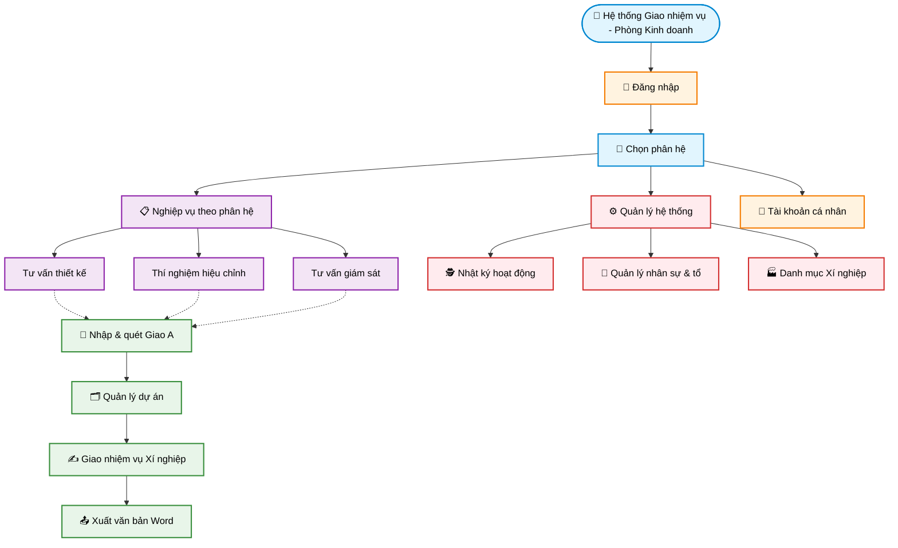

# Workflow 00 — Sơ đồ tổng thể các module

> **Mục đích:** Nhìn nhanh cấu trúc module toàn hệ thống. Chi tiết từng luồng xem ở các workflow `01`–`03`.

## Sơ đồ phân rã module

## Tóm tắt khối chức năng

| Khối | Module con | Vai trò |
|---|---|---|
| Đăng nhập | — | Xác thực người dùng, mở phiên làm việc |
| Chọn phân hệ | TVTK · TN · TVGS | Cửa vào ba tổ nghiệp vụ |
| Nghiệp vụ theo phân hệ | Nhập & quét Giao A · Quản lý dự án · Giao nhiệm vụ · Xuất Word | Luồng chính của mỗi tổ |
| Quản lý hệ thống | Nhật ký · Nhân sự & tổ · Xí nghiệp | Quản trị và truy vết |
| Tài khoản cá nhân | — | Thông tin cá nhân, đổi mật khẩu |

## Workflow chi tiết

- [01 — Nhập dự án từ Giao A](./01_nhap_du_an.md)
- [02 — Giao nhiệm vụ theo dự án](./02_giao_nhiem_vu.md)
- [03 — Giám sát hoạt động và tài khoản](./03_giam_sat_he_thong.md)
