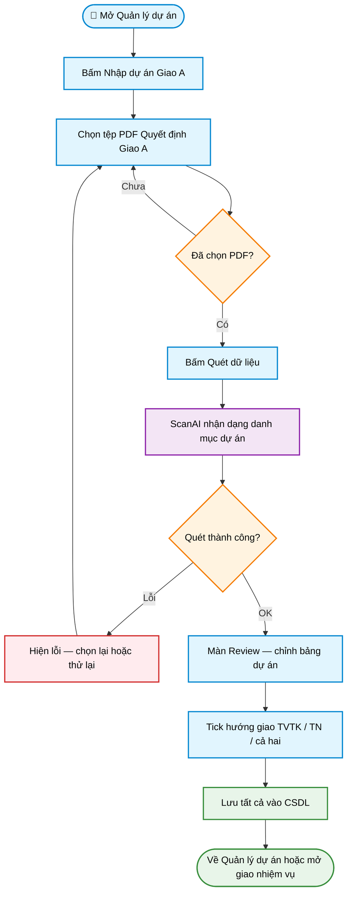

# Workflow — Nhập dự án từ Giao A

> **Màn hình:** Nhập thông tin dự án mới · Review sau ScanAI  
> **Route:** `/nhap-du-an`, `/giao-a/[id]`

## Luồng nghiệp vụ

## Ghi chú

- Bảng trống sẵn trên màn nhập; sau quét chuyển sang Review để sửa.
- Mã dự án sinh theo quy ước tỉnh–năm–cấp–viết tắt (hiện dưới tên DA).
- Cột Ghi chú trên Review = hướng giao (chọn một).

## Phụ lục kỹ thuật

| Mục | Chi tiết |
|-----|----------|
| Upload + ingest | `POST /api/giao-a/ingest` |
| Review UI | `ReviewGiaoAClient.tsx` |
| Model ScanAI | Gemini Flash-Lite |
| SQL liên quan | `001` schema · `002` cấp ĐA · `003` hướng giao |
