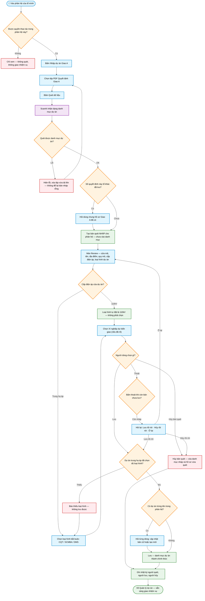

# Workflow — Nhập dự án từ Giao A (quét → duyệt → lưu / hủy)

> **Màn hình:** Nhập dự án Giao A · Review sau ScanAI
> **Route:** `/tvtk/nhap-du-an`, `/thi-nghiem/nhap-du-an`, `/tvgs/nhap-du-an`, `/giao-a/[id]?phan_he=`

## Luồng nghiệp vụ

## Quy tắc «chưa lưu thì chưa tính»

| Tình huống | Hệ thống làm gì |
|---|---|
| Vừa quét xong | Bản quét là **nháp**: chỉ thấy trên màn Review, không hiện ở Quản lý dự án, không giao nhiệm vụ được |
| Bấm Lưu (Lưu tất cả / Lưu & đóng / Lưu & Quét tiếp) | Mọi dòng **trung hạ áp** phải chọn **loại hình dự án** (CQT / SCMBA / DMS); dòng **110kV** hệ thống tự đặt → danh mục thành chính thức, ghi nhật ký người lưu |
| Bấm Hủy bản quét | Xóa danh mục nháp; nếu hồ sơ Giao A chưa từng được lưu thì xóa luôn hồ sơ và tệp PDF |
| Bấm Về Quản lý dự án khi còn nháp | Hộp thoại 3 lựa chọn: Lưu rồi rời · Hủy bản quét rồi rời · Ở lại tiếp tục sửa |
| Đóng tab / bấm F5 khi còn nháp | Trình duyệt cảnh báo rời trang |
| Quét lại đúng số quyết định mà bản nháp trước bỏ dở | Dọn bản nháp bỏ dở, quét lại từ đầu |
| Quét xong nhưng không đọc được dự án nào | Báo lỗi ngay tại màn nhập, xóa tệp vừa tải lên; **không** tạo bản nháp rỗng |

## Ghi chú nghiệp vụ

- Mỗi tổ (Tư vấn thiết kế · Thí nghiệm · Tư vấn giám sát) quét và duyệt trong phân hệ của mình; vào lạc phân hệ chỉ được xem.
- Một Quyết định Giao A có thể sinh nhiệm vụ cho nhiều tổ: tổ sau dùng chung hồ sơ Giao A đã lưu (không tải lại PDF), chỉ tạo danh mục dự án riêng cho tổ mình.
- **Loại hình dự án** dùng cho chi phí sau này, phụ thuộc cấp điện áp:
  - Dự án **110kV** — loại hình luôn là 110kV, hệ thống tự đặt, người nhập không chọn.
  - Dự án **trung hạ áp** — bắt buộc chọn một trong ba: CQT (chống quá tải) · SCMBA (sửa chữa MBA) · DMS.
  - Đổi cấp điện áp từ 110kV sang trung hạ áp thì phải chọn lại loại hình.
  - Khác với «Loại hình tư vấn» (suy ra từ cấp điện áp / hướng giao).
- Tên dự án được phép trùng giữa các phân hệ; mã dự án mang hậu tố phân hệ để phân biệt.
- Cảnh báo trùng tên chỉ đối chiếu với dự án **đã lưu** trong cùng phân hệ.
- Nếu quyết định không có danh mục riêng mà chỉ có bảng phụ lục công trình, hệ thống lấy tên công trình trong phụ lục làm danh mục dự án.

## Phụ lục kỹ thuật

| Mục | Chi tiết |
|-----|----------|
| Upload + ingest | `POST /api/giao-a/ingest` — tạo bản ghi `da_luu = false` |
| Chốt lưu / hủy nháp | `POST` và `DELETE /api/giao-a/[id]/ban-nhap?phan_he=` |
| Danh mục dự án | `GET /api/du-an` mặc định lọc `da_luu = true` (`gom_ban_nhap=1` để lấy cả nháp) |
| Review UI | `ReviewGiaoAClient.tsx` · nút thoát `ThoatReviewLink.tsx` · guard `roi-trang-guard.ts` |
| Model ScanAI | Gemini Flash-Lite |
| SQL liên quan | `001` schema · `002` cấp ĐA · `003` hướng giao · `012` phân hệ + truy vết · `016` cờ `da_luu` · `017` loại hình dự án |
