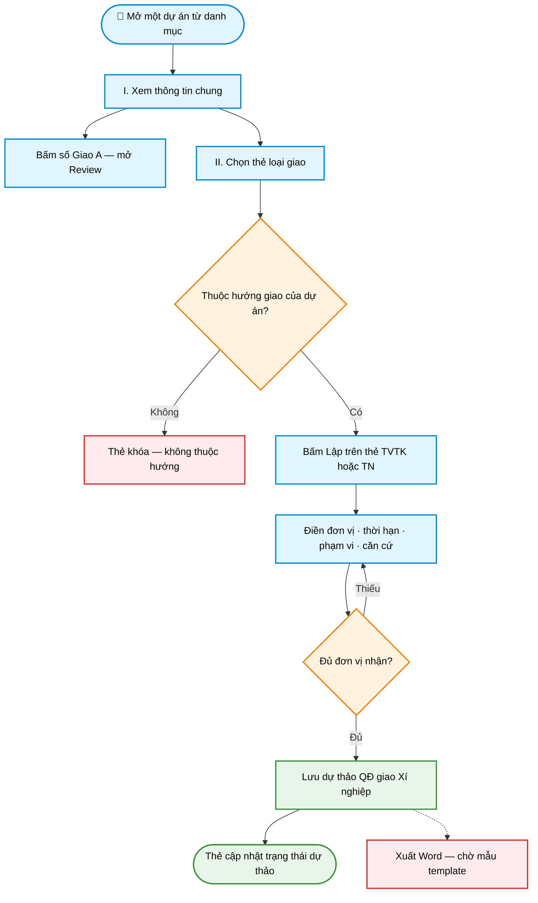

# Workflow — Giao nhiệm vụ theo dự án

> **Màn hình:** Giao nhiệm vụ (mở từ 1 dòng dự án)  
> **Route:** `/du-an/[id]/giao-xn`

## Luồng nghiệp vụ

## Nội dung màn hình

| Phần | Nội dung |
|------|----------|
| I. Thông tin chung | Mã/tên DA, địa điểm, cấp ĐA, hướng giao; Giao A + trích yếu; quy mô |
| II. Giao nhiệm vụ | Thẻ TVTK (xanh) · Thẻ Thí nghiệm (tím); hiện đơn vị / thời hạn nếu đã lập |

## Phụ lục kỹ thuật

| Mục | Chi tiết |
|-----|----------|
| UI | `GiaoNhiemVuSection.tsx` + `SoanQdGiaoXnForm.tsx` |
| API lưu | `POST /api/qd-giao-xn` |
| Danh mục XN | bảng Xí nghiệp · seed `004_seed_xi_nghiep.sql` |
| Word | chưa gắn — chờ mẫu TVTK / TN |
