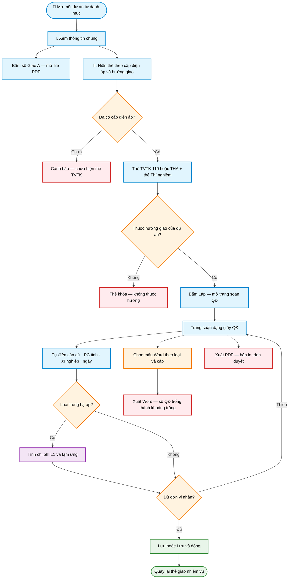

# Workflow — Giao nhiệm vụ theo dự án

> **Màn hình:** Giao nhiệm vụ (mở từ 1 dòng dự án)  
> **Route:** `/du-an/[id]/giao-xn`

## Luồng nghiệp vụ

## Nội dung màn hình

| Phần | Nội dung |
|------|----------|
| I. Thông tin chung | Mã/tên DA, địa điểm, cấp ĐA, hướng giao; Giao A (PDF); quy mô |
| II. Giao nhiệm vụ | Thẻ TVTK theo cấp · Thẻ TN — bấm Lập mở trang soạn |
| Trang soạn | Giấy QĐ pastel theo loại (110 / THA / TN); Lưu · Word · PDF |

## Quy tắc soạn (đã chốt)

| Mục | Quy tắc |
|-----|---------|
| Thẻ TVTK | Chỉ hiện đúng cấp dự án (110 ẩn THA và ngược lại) |
| Chủ đầu tư | Chỉ «Công ty Điện lực [tỉnh]» — cắt phần «để thực hiện…» |
| Địa điểm trống | Suy từ PC tỉnh / tên dự án khi tải danh mục |
| Số QĐ trống | Xuất Word chèn 10 khoảng trắng |
| TVTK THA — L1 | L1 = TMĐT × 3,3% (triệu); tạm ứng = L1 đổi sang đồng + bằng chữ |
| TVTK 110 | Không tính L1 / tạm ứng |
| Màu trang soạn | 110 xanh dương · THA xanh ngọc · TN hồng đào pastel |

## Phụ lục kỹ thuật

| Mục | Chi tiết |
|-----|----------|
| UI thẻ | `GiaoNhiemVuSection.tsx` |
| UI soạn | `SoanQdGiaoXnEditor.tsx` · banner `QdGiaoXnDocBanner.tsx` |
| Theme | `soan-qd-theme.ts` |
| Mặc định PC/XN | `soan-qd-defaults.ts` |
| Tiền L1 / chữ | `tinh-tien-giao-xn.ts` · `so-tien-bang-chu.ts` |
| Word | `fill-qd-giao-xn.ts` · 3 mẫu `public/templates/` |
| PDF Giao A | `GET /api/giao-a/[id]/pdf` |
| SQL | `008_phu_luc_giao_a.sql` · `009_ten_pc_tinh.sql` |
