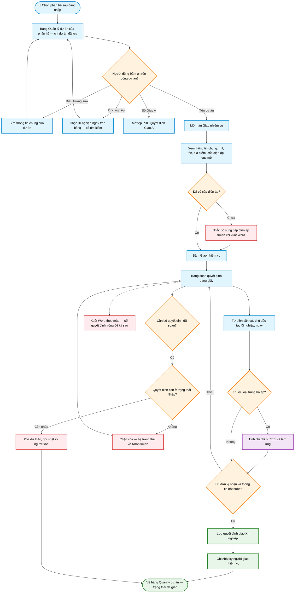

# Workflow — Giao nhiệm vụ theo dự án

> **Màn hình:** Quản lý dự án (bảng danh mục) · Giao nhiệm vụ · Soạn quyết định giao Xí nghiệp
> **Route:** `/tvtk`, `/thi-nghiem`, `/tvgs`, `/du-an/[id]/giao-xn`, `/du-an/[id]/sua`

## Luồng nghiệp vụ

## Nội dung màn hình

| Phần | Nội dung |
|------|----------|
| Bảng Quản lý dự án | Số thứ tự · Mã dự án · Tên dự án (bấm để giao nhiệm vụ) · Loại · Số/ngày Giao A kèm người quét · Xí nghiệp (chọn trực tiếp) · Trạng thái · Sửa |
| Màn Giao nhiệm vụ | Thông tin chung, trích yếu Giao A, quy mô và một nút hành động duy nhất |
| Trang soạn | Giấy quyết định theo loại (110 kV xanh dương · trung hạ áp xanh ngọc · thí nghiệm vàng cát); Lưu · xuất Word |

## Quy tắc soạn (đã chốt)

| Mục | Quy tắc |
|-----|---------|
| Chỉ dự án đã lưu | Bản quét nháp chưa hiện trên bảng nên không thể giao nhiệm vụ |
| Loại quyết định | Theo phân hệ và cấp điện áp của dự án |
| Chủ đầu tư | Chỉ «Công ty Điện lực [tỉnh]» — cắt phần «để thực hiện…» |
| Địa điểm trống | Suy từ chủ đầu tư / tên dự án khi tải danh mục |
| Số quyết định trống | Xuất Word chèn khoảng trắng để điền tay |
| Tư vấn thiết kế trung hạ áp | Chi phí bước 1 = tổng mức đầu tư × 3,3%; tạm ứng kèm số tiền bằng chữ |
| Tư vấn thiết kế 110 kV | Không tính chi phí bước 1 / tạm ứng |
| Xuất PDF | Tạm ẩn nút; giữ logic để bật lại sau |
| Xóa dự thảo | Nút **Xóa dự thảo** trên trang soạn (chỉ hiện khi đã lưu); chỉ xóa khi còn trạng thái Nháp, đã trình GĐ / đã ban hành thì phải hạ trạng thái trước (Admin được xóa để dọn dữ liệu sai) |
| Xóa dự án | Dự án còn quyết định giao Xí nghiệp thì bị chặn xóa — phải xóa dự thảo quyết định trước |

## Phụ lục kỹ thuật

| Mục | Chi tiết |
|-----|----------|
| Bảng danh mục | `DuAnDashboard.tsx` — nguồn `GET /api/du-an?phan_he=` (lọc `da_luu = true`) |
| UI giao nhiệm vụ | `GiaoNhiemVuSection.tsx` |
| Sửa thông tin chung | `/du-an/[id]/sua` · `SuaDuAnForm.tsx` |
| UI soạn | `SoanQdGiaoXnEditor.tsx` · banner `QdGiaoXnDocBanner.tsx` |
| Xóa dự thảo | `DELETE /api/qd-giao-xn/[id]` — chặn khi `trang_thai <> 'nhap'`, ghi nhật ký `GIAO_XN / DELETE` |
| Theme phân hệ | `phan-he.ts` · `soan-qd-theme.ts` |
| Mặc định chủ đầu tư / XN | `soan-qd-defaults.ts` |
| Tiền bước 1 / số thành chữ | `tinh-tien-giao-xn.ts` · `so-tien-bang-chu.ts` |
| Word | `fill-qd-giao-xn.ts` · mẫu trong `public/templates/` |
| PDF Giao A | `GET /api/giao-a/[id]/pdf` |
| SQL | `008_phu_luc_giao_a.sql` · `009_ten_pc_tinh.sql` · `012_phan_he_truy_vet.sql` |
