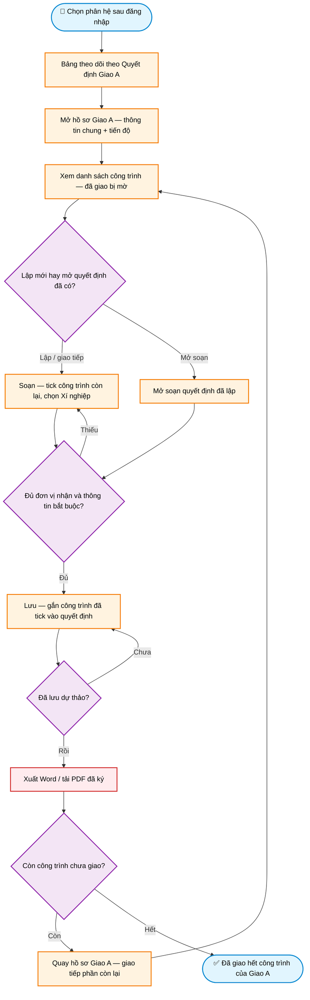

# Workflow — Giao nhiệm vụ theo Giao A

> **Màn hình:** Danh sách Giao A · Theo dõi Giao A · Soạn quyết định giao Xí nghiệp
> **Route:** `/tvtk`, `/thi-nghiem`, `/tvgs`, `/giao-a/[id]/theo-doi`, `/du-an/[id]/giao-xn/soan`

## Luồng nghiệp vụ

## Một quyết định — nhiều công trình

Từ hồ sơ Giao A:

- **Giao tiếp còn lại** → soạn **mới**: công trình đã giao **bỏ tick + khóa**; chỉ tick phần còn lại.
- **Mở soạn** → mở đúng dự thảo đã lập: tick lại công trình thuộc quyết định đó.

Lưu gắn danh sách công trình đã tick. Chia nhiều Xí nghiệp: giao một phần → lưu → quay hồ sơ → giao tiếp phần còn lại.

## Đếm tiến độ (x/y CT)

| Thành phần | Quy tắc |
|------------|---------|
| **Số công trình (y)** | Số dòng phụ lục Giao A; không có phụ lục → số dự án đã lưu |
| **Đã giao (x)** | Số dòng phụ lục đã gắn QĐ (đã Lưu tick); dự thảo cũ chưa có danh sách tick → fallback «có dự thảo = đã giao» (theo số dự án có dự thảo) |

## Nội dung màn hình

| Phần | Nội dung |
|------|----------|
| Bảng Giao A | STT · Số Giao A + ngày · Người quét · Số công trình · Đã giao (x/y CT) · Sửa (Review) · Xóa (chỉ Admin/Trưởng phòng); bấm số Giao A để mở theo dõi |
| Sửa hồ sơ Giao A | Icon Sửa → Review: bổ sung cấp điện áp, loại hình, tên CT… rồi Lưu |
| Xóa hồ sơ Giao A | Chỉ Admin / Trưởng phòng; quét sai → báo Trưởng phòng xóa |
| Hồ sơ Giao A | Thông tin chung + bảng CT theo phụ lục (đã giao mờ) + quyết định đã lập + nút giao |
| Trang soạn | Giấy quyết định; tick CT; **Lưu trước** rồi Xuất Word; Quay lại / Đóng về hồ sơ Giao A |

## Quy tắc soạn (đã chốt)

| Mục | Quy tắc |
|-----|---------|
| Chỉ dự án đã lưu | Bản quét nháp chưa hiện trên bảng nên không thể giao nhiệm vụ |
| Loại quyết định | Theo phân hệ và cấp điện áp của dự án |
| Chủ đầu tư | Chỉ «Công ty Điện lực [tỉnh]» — cắt phần «để thực hiện…»; **giữ theo dự án** khi giao XN khác tỉnh |
| Nơi nhận (Word) | Gọn: Như Điều 3 · Ban Giám đốc · Lưu VT, KD — **không** lặp tên XN; XN nhận ở thân QĐ / Điều 3 (`{ten_xi_nghiep}`) |
| Địa điểm trống | Suy từ chủ đầu tư / tên dự án khi tải danh mục |
| Số quyết định trống | Xuất Word chèn khoảng trắng để điền tay / Doffice |
| Ngày ban hành trống | Xuất Word: «ngày … tháng … năm …» thành khoảng trắng (không dấu chấm) để Doffice điền |
| Danh xưng Giám đốc XN (Điều 3) | Câu gọn: `{danh_xung_gd_xn} Giám đốc {ten_xi_nghiep}…` — **Tuyên Quang** → Bà; XN khác → Ông (TVTK 110/THA, TVGS, TNHC) |
| Tư vấn thiết kế trung hạ áp | Chi phí bước 1 / GHĐ theo loại hình (XDM·Cải tạo 3,3% · SCMBA·DMS 1,5%); tạm ứng lần 1 = **10%** × GHĐ (làm tròn hàng triệu); số tiền **đồng** |
| Tư vấn thiết kế 110 kV | Không tính chi phí bước 1 / tạm ứng |
| Tư vấn giám sát | Giá trị HĐ = TMĐT × **1%** → hiển thị/xuất **đồng**; không tạm ứng; tiền bằng số/chữ; mẫu `qd-giao-nhiem-vu-tvgs.docx` |
| Thí nghiệm | Tính sau |
| Tên tệp Word | `GNV-[viết tắt XN]-[mã DA]-[yyyyMMdd]-[HHmmss].docx` |
| Xuất PDF | Tạm ẩn nút; giữ logic để bật lại sau |
| Tải PDF đã ký | Nút trên trang soạn — lưu tệp, chuyển «Đã giao», bỏ dấu Dự thảo |
| Xóa dự thảo | Chỉ khi còn Nháp; đã giao thì chỉ Admin được xóa để dọn dữ liệu sai |
| Xóa dự án | Dự án còn quyết định giao Xí nghiệp thì bị chặn xóa — phải xóa dự thảo quyết định trước |
| Một QĐ nhiều công trình | Tick chọn công trình giao lần này; lưu danh sách tick; map theo tên; chặn lập trùng; xóa QĐ gỡ map |
| Xuất Word | Chỉ bật sau khi đã **Lưu** dự thảo (không tự lưu khi xuất) |
| Giao tiếp còn lại | Soạn mới — CT đã giao khóa + bỏ tick; **Mở soạn** mới tick CT của dự thảo đó |

## Phụ lục kỹ thuật

| Mục | Chi tiết |
|-----|----------|
| Hub chọn phân hệ | `page.tsx` · `hub-phan-he-stats.ts` |
| Bảng danh mục | `GiaoADashboard.tsx` — `GET /api/giao-a?phan_he=` · đếm CT `giao-a-ct-stats.ts` |
| Theo dõi Giao A | `GiaoATheoDoiClient.tsx` · `/giao-a/[id]/theo-doi` · `GET .../theo-doi` |
| UI soạn | `SoanQdGiaoXnEditor.tsx` · `return_to` · `moi=1` soạn mới phần còn lại |
| CT đã tick | cột `qd_giao_xn.cong_trinh_chon` · SQL `024` |
| Map nhiều DA | `qd-giao-xn-map.ts` · bảng `qd_giao_xn_du_an` · SQL `019` |
| Danh xưng GD XN | `danh-xung-gd-xn.ts` · tag `{danh_xung_gd_xn}` |
| Xóa dự thảo | `DELETE /api/qd-giao-xn/[id]` — chặn khi `trang_thai <> 'nhap'`, ghi nhật ký `GIAO_XN / DELETE` |
| PDF đã ký | `POST/GET /api/qd-giao-xn/[id]/pdf-ky` · SQL `018_qd_giao_xn_pdf_ky.sql` · bucket `qd-giao-xn` |
| Theme phân hệ | `phan-he.ts` · `soan-qd-theme.ts` |
| Mặc định chủ đầu tư / XN | `soan-qd-defaults.ts` |
| Tiền bước 1 / số thành chữ | `tinh-tien-giao-xn.ts` · `so-tien-bang-chu.ts` |
| Word | `fill-qd-giao-xn.ts` · `format-ngay.ts` · `template-path.ts` · mẫu `public/templates/` (gồm `qd-giao-nhiem-vu-tvgs.docx`) |
| PDF Giao A | `GET /api/giao-a/[id]/pdf` |
| SQL | `008` · `009` · `012` · `018` · `019` · `020_loai_hinh_xdm_cai_tao.sql` · `021_loai_hinh_tnhc_tvgs.sql` · `022_xi_nghiep_dien_bien.sql` |
