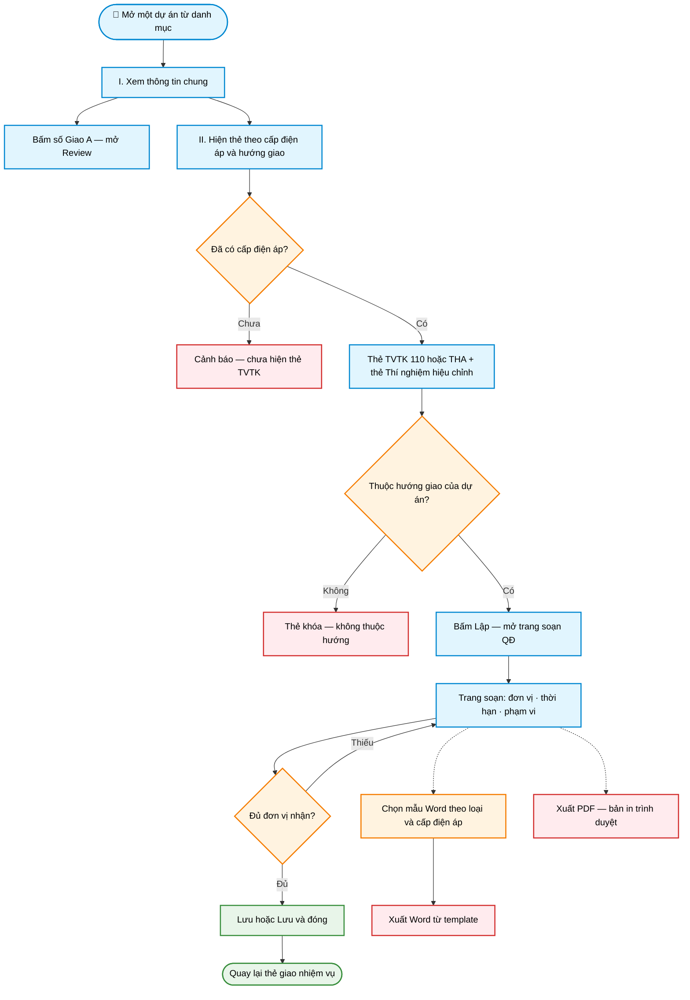

# Workflow — Giao nhiệm vụ theo dự án

> **Màn hình:** Giao nhiệm vụ (mở từ 1 dòng dự án)  
> **Route:** `/du-an/[id]/giao-xn`

## Luồng nghiệp vụ

## Nội dung màn hình

| Phần | Nội dung |
|------|----------|
| I. Thông tin chung | Mã/tên DA, địa điểm, cấp ĐA, hướng giao; Giao A + trích yếu; quy mô |
| II. Giao nhiệm vụ | Thẻ TVTK theo cấp · Thẻ TN — bấm Lập mở trang soạn |
| Trang soạn | Lưu · Lưu & đóng · Xuất Word · Xuất PDF |

## Phụ lục kỹ thuật

| Mục | Chi tiết |
|-----|----------|
| UI thẻ | `GiaoNhiemVuSection.tsx` |
| UI soạn | `SoanQdGiaoXnEditor.tsx` · route `/du-an/[id]/giao-xn/soan` |
| Lọc thẻ | TVTK theo `du_an.cap_dien_ap`; DB `loai` vẫn `tvtk` \| `thi_nghiem` |
| API | `POST/PATCH /api/qd-giao-xn` · `POST .../export/word` |
| Word | `docxtemplater` + 3 mẫu `public/templates/` |
| PDF | trang in `/soan/in` (Save as PDF trình duyệt) |
