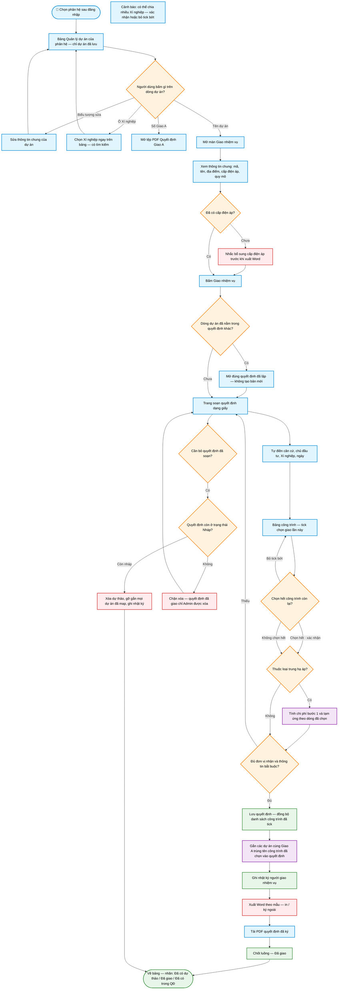

# Workflow — Giao nhiệm vụ theo dự án

> **Màn hình:** Quản lý dự án (bảng danh mục) · Giao nhiệm vụ · Soạn quyết định giao Xí nghiệp
> **Route:** `/tvtk`, `/thi-nghiem`, `/tvgs`, `/du-an/[id]/giao-xn`, `/du-an/[id]/sua`

## Luồng nghiệp vụ

## Nhãn cột Giao Xí nghiệp

| Tình huống | Hiện dưới tên Xí nghiệp |
|---|---|
| Chưa chọn / chưa soạn QĐ | Chưa giao hoặc Chưa lập QĐ |
| Đã lưu dự thảo (dự án chủ) | Đã có dự thảo |
| Đã tải PDF ký | Đã giao (bấm để xem PDF) |
| Dự án khác đã nằm trong cùng quyết định | Đã có trong QĐ (hoặc Trong QĐ + số) — bấm mở quyết định đã lập |

## Một quyết định — nhiều công trình

Khi soạn từ **một** dự án, mục **Công trình giao lần này** liệt kê phụ lục Giao A: **tick** công trình giao cho Xí nghiệp đang chọn (dòng đã giao đơn vị khác bị khóa). Lưu / xuất Word / tải PDF ký **gắn** các dự án khớp tên đã tick. Muốn chia nhiều Xí nghiệp: bỏ tick phần còn lại → lưu QĐ 1 → lập QĐ tiếp cho phần còn lại. Xóa dự thảo → gỡ toàn bộ gắn kết.
## Nội dung màn hình

| Phần | Nội dung |
|------|----------|
| Bảng Quản lý dự án | Số thứ tự · Mã dự án · Tên dự án (bấm để giao nhiệm vụ) · Loại · Số/ngày Giao A kèm người quét · Xí nghiệp (chọn trực tiếp) · Trạng thái · Sửa |
| Màn Giao nhiệm vụ | Thông tin chung, trích yếu Giao A, quy mô và một nút hành động duy nhất |
| Trang soạn | Giấy quyết định theo loại (110 kV xanh dương · trung hạ áp xanh ngọc · thí nghiệm vàng cát); Lưu · xuất Word |

## Quy tắc soạn (đã chốt)

| Mục | Quy tắc |
|-----|---------|
| Chỉ dự án đã lưu | Bản quét nháp chưa hiện trên bảng nên không thể giao nhiệm vụ |
| Loại quyết định | Theo phân hệ và cấp điện áp của dự án |
| Chủ đầu tư | Chỉ «Công ty Điện lực [tỉnh]» — cắt phần «để thực hiện…» |
| Địa điểm trống | Suy từ chủ đầu tư / tên dự án khi tải danh mục |
| Số quyết định trống | Xuất Word chèn khoảng trắng để điền tay / Doffice |
| Ngày ban hành trống | Xuất Word: «ngày … tháng … năm …» thành khoảng trắng (không dấu chấm) để Doffice điền |
| Danh xưng Giám đốc XN (Điều 3) | Xí nghiệp DVĐL **Hà Giang** → Bà; các Xí nghiệp khác → Ông |
| Tư vấn thiết kế trung hạ áp | Chi phí bước 1 / GHĐ theo loại hình (XDM·Cải tạo 3,3% · SCMBA·DMS 1,5%); tạm ứng 15%/16% theo địa bàn; số tiền **đồng** |
| Tư vấn thiết kế 110 kV | Không tính chi phí bước 1 / tạm ứng |
| Tư vấn giám sát | Giá trị HĐ = TMĐT × **1%** → hiển thị/xuất **đồng**; không tạm ứng; tiền bằng số/chữ; mẫu `qd-giao-nhiem-vu-tvgs.docx` |
| Thí nghiệm | Tính sau |
| Tên tệp Word | `GNV-[viết tắt XN]-[mã DA]-[yyyyMMdd]-[HHmmss].docx` |
| Xuất PDF | Tạm ẩn nút; giữ logic để bật lại sau |
| Tải PDF đã ký | Nút trên trang soạn — lưu tệp, chuyển «Đã giao», bỏ dấu Dự thảo |
| Xóa dự thảo | Chỉ khi còn Nháp; đã giao thì chỉ Admin được xóa để dọn dữ liệu sai |
| Xóa dự án | Dự án còn quyết định giao Xí nghiệp thì bị chặn xóa — phải xóa dự thảo quyết định trước |
| Một QĐ nhiều công trình | Tick chọn công trình giao lần này; map theo tên đã tick; chặn lập trùng; xóa QĐ gỡ map |

## Phụ lục kỹ thuật

| Mục | Chi tiết |
|-----|----------|
| Hub chọn phân hệ | `page.tsx` · `hub-phan-he-stats.ts` |
| Bảng danh mục | `DuAnDashboard.tsx` — nguồn `GET /api/du-an?phan_he=` (lọc `da_luu = true`) + `qd_giao_xn_map` |
| UI giao nhiệm vụ | `GiaoNhiemVuSection.tsx` |
| Sửa thông tin chung | `/du-an/[id]/sua` · `SuaDuAnForm.tsx` |
| UI soạn | `SoanQdGiaoXnEditor.tsx` · banner `QdGiaoXnDocBanner.tsx` |
| Map nhiều DA | `qd-giao-xn-map.ts` · bảng `qd_giao_xn_du_an` · SQL `019_qd_giao_xn_du_an.sql` |
| Danh xưng GD XN | `danh-xung-gd-xn.ts` · tag `{danh_xung_gd_xn}` |
| Xóa dự thảo | `DELETE /api/qd-giao-xn/[id]` — chặn khi `trang_thai <> 'nhap'`, ghi nhật ký `GIAO_XN / DELETE` |
| PDF đã ký | `POST/GET /api/qd-giao-xn/[id]/pdf-ky` · SQL `018_qd_giao_xn_pdf_ky.sql` · bucket `qd-giao-xn` |
| Theme phân hệ | `phan-he.ts` · `soan-qd-theme.ts` |
| Mặc định chủ đầu tư / XN | `soan-qd-defaults.ts` |
| Tiền bước 1 / số thành chữ | `tinh-tien-giao-xn.ts` · `so-tien-bang-chu.ts` |
| Word | `fill-qd-giao-xn.ts` · `format-ngay.ts` · `template-path.ts` · mẫu `public/templates/` (gồm `qd-giao-nhiem-vu-tvgs.docx`) |
| PDF Giao A | `GET /api/giao-a/[id]/pdf` |
| SQL | `008` · `009` · `012` · `018` · `019` · `020_loai_hinh_xdm_cai_tao.sql` · `021_loai_hinh_tnhc_tvgs.sql` · `022_xi_nghiep_dien_bien.sql` |
