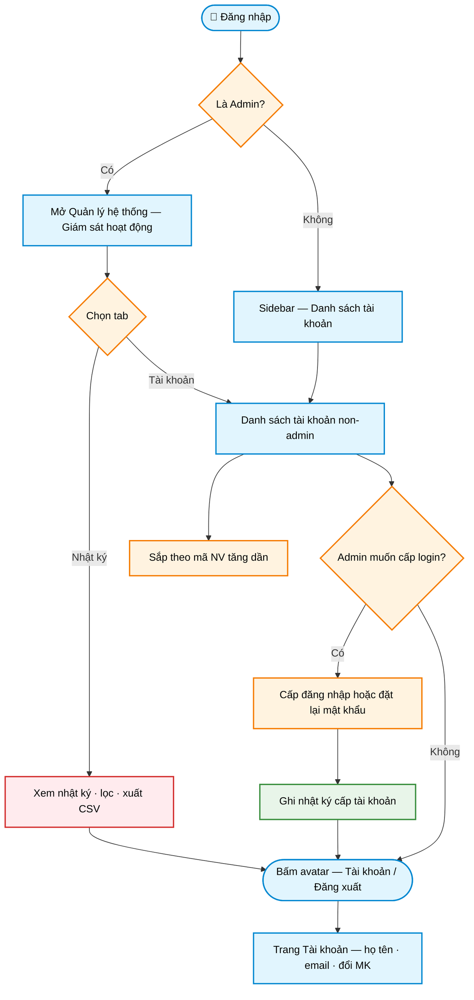

# Workflow — Giám sát hoạt động & danh sách tài khoản

> **Màn hình:** Giám sát hoạt động (Admin) / Danh sách tài khoản (user)  
> **Route:** `/he-thong/giam-sat` · `/he-thong/tai-khoan`

## Luồng nghiệp vụ

## Nội dung màn hình

| Vai trò | Nội dung |
|---------|----------|
| Admin | Tab Nhật ký hoạt động + Danh sách tài khoản; thao tác cấp / đặt lại MK |
| User thường | Chỉ danh sách tài khoản (không tab nhật ký); sidebar mục «Danh sách tài khoản» |
| Avatar sidebar | Hiện họ tên; menu: Tài khoản · Đăng xuất |
| Tài khoản | Họ và tên · Email · đổi MK (tùy chọn) — không hiện User ID |

## Cột bảng Nhật ký hoạt động

| Cột | Nội dung |
|-----|----------|
| STT | Theo trang đang xem |
| Người thực hiện | Họ tên; dòng phụ là email (riêng tài khoản `admin@gnvnpsc.local` hiện **Admin**) |
| Phân hệ | Nhóm nghiệp vụ: Xác thực · Dự án · Quyết định Giao A · Giao Xí nghiệp · Hệ thống |
| Hành động | Đăng nhập · Đăng xuất · Tạo mới · Cập nhật · Xóa · Xuất văn bản · Quét tài liệu · Cấp đăng nhập… kèm thời điểm |
| Chi tiết | Mô tả việc đã làm, mã đối tượng đầy đủ và các thông tin kèm theo |

Quy ước trình bày nhật ký:

- Toàn bộ nhãn và giá trị trong cột Chi tiết hiển thị **tiếng Việt đầy đủ**, không viết tắt kỹ thuật.
- Tên tổ, trạng thái quyết định, loại hình dự án được dịch sang tên nghiệp vụ.
- Mã đối tượng hiện đủ, dùng phông đơn cách để đối chiếu khi tra cứu.
- Nội dung mọi ô căn giữa theo chiều dọc; tiêu đề cột căn giữa.
- Bộ lọc Phân hệ và Hành động cũng dùng tên đầy đủ tiếng Việt.
- Checkbox **Hide Admin**: khi bật, ẩn dòng do tài khoản Admin thực hiện — chỉ xem hoạt động non-admin.

**Giao Xí nghiệp được ghi:** tạo dự thảo · lưu dự thảo · xuất Word · tải PDF đã ký · xóa dự thảo (phân hệ «Giao Xí nghiệp»). Xuất Word thường kèm một dòng Lưu ngay trước đó.

## Cột danh sách tài khoản

| Cột | Ghi chú |
|-----|---------|
| Mã NV | Sắp tăng dần (KD01…KD17) |
| Họ tên | |
| Email | |
| Số điện thoại | |
| Thao tác | Chỉ Admin — Cấp đăng nhập / Đặt lại MK |

## Phụ lục kỹ thuật

| Mục | Chi tiết |
|-----|----------|
| SQL | `scripts/sql/010_nhat_ky_hoat_dong.sql` → bảng `nhat_ky_hoat_dong` |
| Logger | `src/lib/activity-log.ts` — login / logout / cấp TK / DA / Giao A / Giao XN (CREATE·UPDATE·EXPORT·DELETE·PDF ký) |
| API | `GET/POST /api/nhat-ky` · `GET /api/tai-khoan` |
| UI | `GiamSatHeThongClient.tsx` · `SidebarUserFooter.tsx` |
